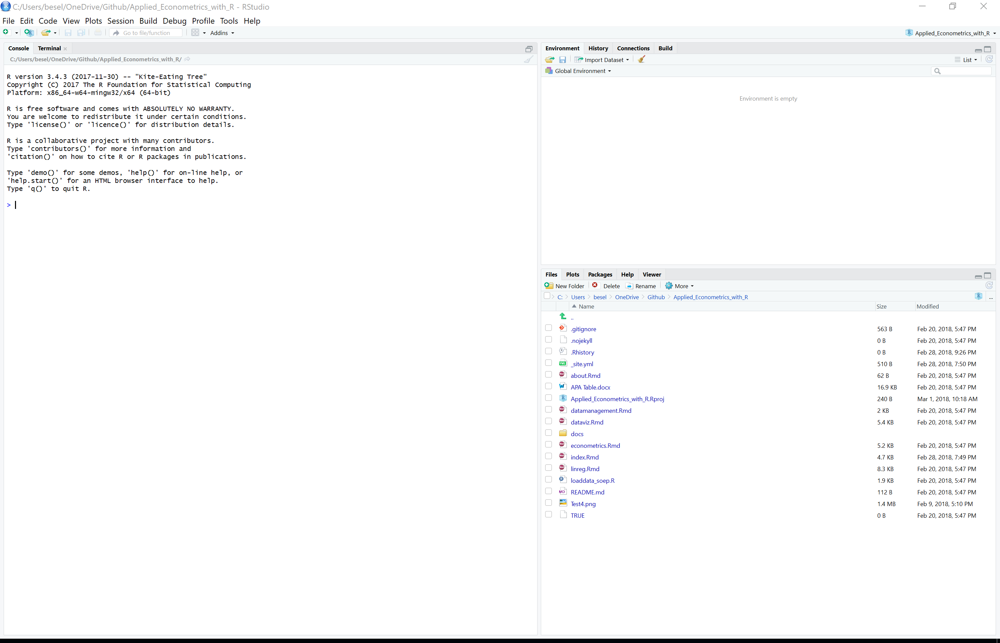

```{r setup, include=FALSE}
knitr::opts_chunk$set(echo = TRUE)
```
***
# Intro and Agenda

Welcome to this introductory **R Intro** tutorial. The following paragraphs will get you familiar with R and hopefully make you full-fledged R users in no time. 

By the end of tomorrow, everybody of you will not only understand the basic functionality of R(Studio) but also be able to 

* efficiently manage data

* write reproducible and easy to read code

* produce beautiful data visualizations

* generate straight forward regressions. 

~75% of our class will be hands-on - e.g. we solve coding problems from real life data (which are relevant for ISG) together. All code and necessary data can be downloaded from this site. 


Die Seite ist in Englisch, weil alle meine anderen R Tutorien/Kurse auch in Englisch waren - please forgive me.

##  Agenda
We have two days, 4 hours per day. 

**Day 1**
* R Basics, Workflow in R Studio and Objects (1.5h)

* Data Management and tidyverse (2h)

  + Quick Intro into the tidyverse and it's data management tools
  
  + Eurostat Example
  
  + Destatis Example


**Day 2** 
* Data visualizationsand the tidyverse (2h)

  + Quick intro into ggplot
  
  + Eurostat Example
  
  + Destatis Example
  
* Regressions (.5h)

* knitr, R Notebooks (1h)


## Why R
R is a powerful programming language that is especially well-suited for statistical analyses and the creation of graphics. It is one of the most widely used software packages in Data Science and Applied Statistics.

It is **free** and **constantly extended by a large user community** - guaranteeing that latest innovations from visualizationsto machine learning are always up to date in the R universe. There are over 15.000 approved R packages (reusable R functions, see below) and the number is growing [exponentially](https://gist.github.com/daroczig/3cf06d6db4be2bbe3368). At the same time, the R-Foundation (supported by Microsoft and Google) gives credibility to the continuance of base R itself.

As it is free and extremely popular, the 

Finally, this might be relevant in our context: Visualizations are way prettier and user friendlier than anything Stata or SPSS even remotely have to offer (see the [R-Graph Gallery](https://www.r-graph-gallery.com/) for a quick glimpse into what is possible).  


*****
# Technical Set-Up
***
## Installation
R is the software executing your commands. 

BUT: R itself is not quite user-friendly - the pane is inconvenient to maneuver. Therefore, there are various interfaces that can be added on top on the plain R. 
The most common one is R-Studio. 


**Download R**: 

[MACOSX](https://cran.rstudio.com/bin/macosx/)

[Windows](https://cran.r-project.org/bin/windows/)


**Download R Studio**: 

[Link](https://www.rstudio.com/products/rstudio/download/)


**Trouble Shooting**

If you have any problems with the installation process follow these pages

[MACOSX](https://www.r-bloggers.com/installing-r-on-os-x/)

[Windows](https://www.r-bloggers.com/download-and-install-r-in-windows/)


***
## First Step
After having successfully installed R and R-Studio open RStudio (*NEVER open R directly, always access it through RStudio*), you should see something like this: 


The big one on the left is called *Console* and it is the plain R execution window: 
You can type single lines of code in there and they are executed immediately after pressing Enter. 

On the right hand side you see the *Environment*. The Environment is just a place to store variables – a set of bindings between symbols and objects. If you open R and make an assignment, you're adding an entry in the global environment (we'll come back to that shortly). 

On the lower left hand side various information about your current project can be retrieved (amongst them the Help section which explains functions). Also, plots can be given a first view in that part. 


***
## Working Directories/PROJECTS
**Always** use projects - they make your life much easier.
RStudio projects make it straightforward to divide your work into multiple contexts, each with their own working directory, workspace, history, and source documents.

It is - especially in the beginning - the most convenient way to source all your data (and scripts) at one place. Important: **You need to designate one folder in your explorer system within which everything related to your very first project is saved.** 

To create a new project, use the Create Project command (available on the Projects menu and on the global toolbar). 
Press: New Directory 


This creates a project file (with an .Rproj extension) within the project directory. You can use this file in your folder as a shortcut to open the project.

When you simply quit a project by closing RStudio or the project directly all files, code, .RData and RStudio settings are saved. 

***
# TaschenrechneR 1
Ok - by now we have invested a lot of time potentially doing nothing else but setting up stuff we have no use for. Can't we get started right away?

Of course - let's do some calculations.
Type the following into the Console:
```{r}
1+1 #What might be the result
# Hashtags tell R that everything in the same line behind them should not be run by the program.
```

Wow - by now we know that R has the same power as a very simple calculator. 
As every simple calculator, you can write only one line of code at once and cannot save anything in a larger context. This is of course problematic because we will want R to execute larger chunks of code.
If we would want to multiply 1+1 in a next step by two and then in a third step divide it by four, we would have to write everything in the only available calculator line.
There must be a better way around this.

***
# R Scripts and (plain) text
Of course there is - R Scripts!
An R Script contains all commands including those for reading the raw data, data manipulation, estimation, post-estimation analyses, and the creation of graphs and tables. We can ask R to run all or some of the commands listed in the R script at once. 
This is key because what we are interested in for every project is reproducibility. When relying on R Scripts we can backtrack all the changes we made to our data and the assumptions we were relying on in our analysis with a simple mouse click. 

To open the editor for creating a new R script click on the symbol in the top left corner and choose open a new R script. Be sure to save it in the same folder where also your RProject is saved. 

As discovered above, the # Symbol is extremely useful because it allows you to comment on stuff without the comment itself being evaluated by R. 

From the R script we can "send" lines of code to R to be evaluated. To run the line in which the cursor is, press **Ctrl+Enter**. To run several lines of code, mark them with the mouse and do the same. 

Try it out with running the following code:
```{r}
1+1
5+(4-1)^2

```

Of course, R can read and evaluate plain text. We'll get into that on the next page. For an intuitive start, consider this:

```{r}
sqrt(4)
log(10)
```


***
# Packages
One more thing... 

R itself can operate only very basic tasks. Even within todays tutorial you will soon discover that you need extensions to run your stuff. These extensions are called packages: "Packages are the fundamental units of reproducible R code. They include reusable R functions, the documentation that describes how to use them, and sample data." ([R packages](http://r-pkgs.had.co.nz/)) They are developed by the large R users community and for free, too. If they meet certain quality criteria, they are published on the official "Comprehensive R Archive Network" (CRAN). 

You only have to install packages once on your computer - all you need is a simple line of code. After having installed it once, you have to "access" it every time you begin a new project/task.

```{r eval=FALSE}
install.packages("package name")
# But installing a project implies just that you have saved it on your computer.
# To make it useable for your session you still have to open it every time (e.g. you need the following line in your script:)
library(packagename)
```

Let's introduce only one small package for now to understand the package functionality. 
The pipe ```%>%``` operator from the magrittr package (which in turn is part of the [tidyverse](https://www.tidyverse.org/)).


The Pipe operator pipes the last element of something into the first one of the next: ```f(x)``` becomes ```x %>% f()``` 


```{r}
# Lets say we want to collect many numbers, perhaps all numbers from 1 to 5.
# How do we do that? With a vector.
# You can tell R to collect numbers in a vector with c(number, number, number)
c(1, 2, 3, 4, 5)
# A cooler way to write this is:
c(1:5)

# Now lets say, we want to get the mean from that list
mean(c(1:5))

# And here comes the power of the pipe:
# install.packages(magrittr) # remove the hashtag in the beginning of the line
library(magrittr)
c(1, 2, 3, 5) %>% mean()
```	

# Style
Arguably not the most important thing right now as we are just getting started. Nevertheless, it is important to have consistent and clean code. So you may want to circle back to this section once you get started writing your own code independently. 

All code you'll encounter in this tutorial is written in tidy style (see link below). 

The basic shortcut for the RStudio IDE to get tidy code is a) selecting code to be reformatted and b) pressing ```Ctrl+Shift+A```. 

A pretty exhaustive style guide by Hadley Wickham and the tidyverse team can be found [here](https://style.tidyverse.org/). This builds upon the still widely referenced [Google's R Style guide](https://google.github.io/styleguide/Rguide.xml). 

# Important Ressources
[Stackoverflow](https://www.stackoverflow.com/):
A general discussion forum for programmers, including many R users.
Just google your question and make sure to place an "R" in the beginning of your question. Most often you will be directed to stackoverflow. 


[Econometrics for R](http://www.urfie.net/):
Great book - first half of this class is based upon it.
Has some 60pages of introduction into R.

[Data Camp](https://www.datacamp.com/):
Online tutorials with in-browser coding tasks. Everything beyond beginners levels is behind a paywall. 

**Cheat Sheets**:
Cheat Sheets are a great way to get a concise overview over the functionality and logic of the R topic they cover. to the best of my knowledge, all major packages have one. Some examples

* [Cheat Sheet Base R](https://www.rstudio.com/wp-content/uploads/2016/05/base-r.pdf)

* [Cheat Sheet dplyr](https://www.rstudio.com/wp-content/uploads/2015/02/data-wrangling-cheatsheet.pdf)

* [Cheat Sheet ggplot](https://www.rstudio.com/wp-content/uploads/2015/03/ggplot2-cheatsheet.pdf)

